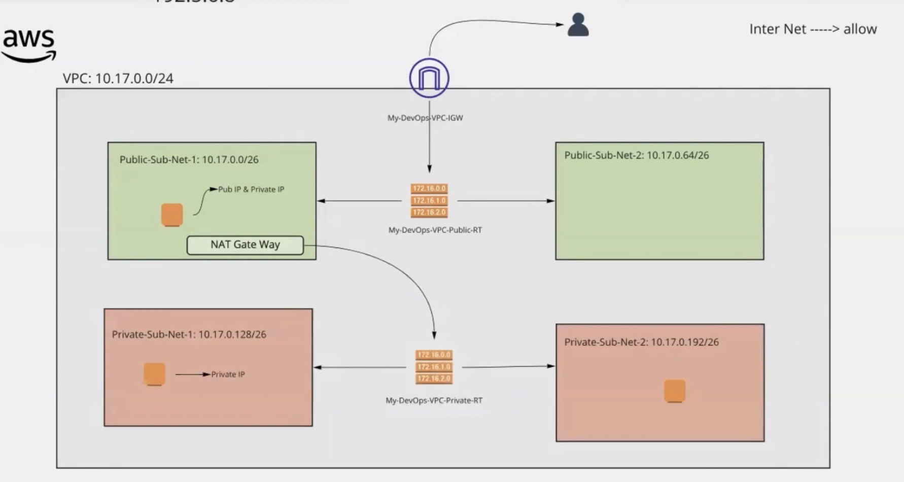
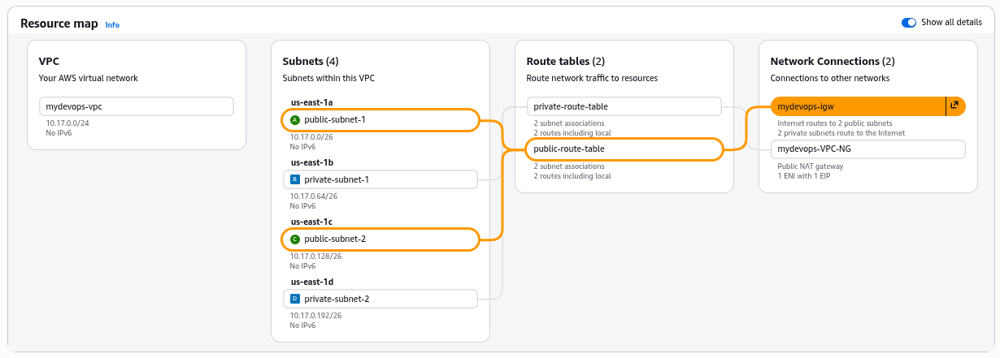

# AWS VPC Setup — Step-by-Step

Goal: Create a custom VPC with public and private subnets, an Internet Gateway, NAT Gateway, route tables, and test EC2 instances.

<<<<<<< HEAD

=======

>>>>>>> b6c8ec78698176405575963ac2071c19a4772f37

## Prerequisites

- AWS account with permissions for VPC, EC2, Elastic IP, and NAT Gateway
- Familiarity with CIDR notation and AWS networking
- EC2 key pair for SSH access

<<<<<<< HEAD

=======
!
>>>>>>> b6c8ec78698176405575963ac2071c19a4772f37

## Overview

- VPC CIDR: `10.17.0.0/24` (example)
- Public subnets: internet-facing (connected to IGW)
- Private subnets: no direct inbound internet, outbound via NAT

---

## Step 1: Create a Custom VPC

1. Sign in to the AWS Management Console and open the VPC Dashboard.
2. Click **Create VPC**.
3. Configure:
   - Resources to create: `VPC only` (or `VPC and more` if you want AWS to auto-create subnets)
   - Name tag: `mydevops-vpc` (or a name you prefer)
   - IPv4 CIDR block: `10.17.0.0/24`
4. Click **Create VPC**.

Tip: Use /24 for small labs; use /16 for larger networks.

## Step 2: Create Subnets
Subnets segment the VPC for public-facing and internal resources.

Create Public Subnets

1. In the VPC Dashboard, go to **Subnets** → **Create subnet**.
2. Configure the first public subnet:
   - VPC ID: `mydevops-vpc`
   - Subnet name: `public-subnet-1`
   - Availability Zone: `ap-south-1a`
   - IPv4 CIDR block: `10.17.1.0/26` (64 IPs)
3. Click **Create subnet**.
4. Repeat for a second public subnet:
   - Name: `public-subnet-2`
   - AZ: `ap-south-1b`
   - CIDR: `10.17.0.64/26`

Create Private Subnets

1. Click **Create subnet** again.
2. Configure the first private subnet:
   - VPC ID: `mydevops-vpc`
   - Subnet name: `private-subnet-1`
   - Availability Zone: `ap-south-1c`
   - CIDR: `10.17.0.128/26`
3. Click **Create subnet**.
4. Repeat for a second private subnet:
   - Name: `private-subnet-2`
   - AZ: `ap-south-1a` (or another AZ)
   - CIDR: `10.17.0.192/26`

Tip: Spread subnets across Availability Zones for high availability. Ensure CIDRs fit inside the VPC and do not overlap.

## Step 3: Create Route Tables

Create Public Route Table

1. In the VPC console go to **Route Tables** → **Create route table**.
2. Configure:
   - Name: `public-route-table`
   - VPC: `mydevops-vpc`
3. Click **Create**.
4. Select the route table, open **Subnet associations**, click **Edit subnet associations**, and associate `public-subnet-1` and `public-subnet-2`.
5. Save associations.

Create Private Route Table

1. Click **Create route table**.
2. Configure:
   - Name: `private-route-table`
   - VPC: `mydevops-vpc`
3. Click **Create**.
4. Edit subnet associations and associate `private-subnet-1` and `private-subnet-2`.
5. Save associations.

## Step 4: Create and Attach an Internet Gateway (IGW)

1. Go to **Internet Gateways** → **Create internet gateway**.
2. Name tag: `mydevops-igw`.
3. Click **Create internet gateway**.
4. Select the new IGW, choose **Actions** → **Attach to VPC**, select `mydevops-vpc`, and attach.

## Step 5: Configure Routes for Internet Access

1. Open **Route Tables**, select `public-route-table`.
2. Go to the **Routes** tab and click **Edit routes**.
3. Add a route:
   - Destination: `0.0.0.0/0`
   - Target: Internet Gateway → select `mydevops-igw`
4. Save changes.

Note: Do NOT add this 0.0.0.0/0 → IGW route to the private route table. Private subnets should not have direct inbound internet access.

## Step 6: Launch EC2 Instances for Testing

Launch in Public Subnet

1. Open the EC2 Dashboard → **Launch Instance**.
2. Configure:
   - Name: `public-instance-1`
   - AMI: Amazon Linux 2 (free tier eligible)
   - Instance type: `t2.micro`
   - Key pair: select an existing key pair
   - Network settings:
     - VPC: `mydevops-vpc`
     - Subnet: `public-subnet-1`
     - Auto-assign Public IP: **Enable**
   - Security group: create `public-sg` allowing SSH (port 22) from your IP (or 0.0.0.0/0 for quick demos)
3. Launch the instance.
4. Test: Run `ping google.com` (should work via IGW).

Launch in Private Subnet

1. Repeat the EC2 launch steps:
   - Name: `private-instance-1`
   - Subnet: `private-subnet-1`
   - Auto-assign Public IP: **Disable**
   - Security group: allow SSH from within the VPC or from a bastion host only
2. Launch the instance.
3. Test: Run `ping google.com` (should work via NAT Gateway).

## Step 7: Test Connectivity

Public Instance

- SSH from your workstation: `ssh -i your-key.pem ec2-user@<public-ip>` (AMI user may vary)
- From the public instance: `ping www.google.com` — should succeed (internet via IGW).

Private Instance

- Access via jump host: SSH from the public instance to the private instance using its private IP.
- From the private instance: `ping www.google.com` — will fail unless you configure a NAT Gateway for outbound access.

## Advanced Setup: NAT Gateway (for private outbound internet)

1. In the VPC console go to **NAT Gateways** → **Create NAT gateway** Name tag: `mydevops-VPC-NG`
2. Availability mode → Zonal 
3. Choose a **public subnet** for the NAT Gateway and allocate or choose an Elastic IP.
4. Create the NAT Gateway (may take a few minutes).
5. Edit `private-route-table` routes and add:
   - Destination: `0.0.0.0/0`
   - Target: NAT Gateway (select the NAT Gateway you created)

Note: NAT Gateways incur charges. For cost-sensitive labs, a NAT instance is an alternative but requires maintenance.

<<<<<<< HEAD
=======
---

# Part 2: Real-World VPC Configuration

This section covers enterprise-grade VPC configurations commonly used in production environments.

## Real-World VPC Architecture (3-Tier Architecture)

```
┌─────────────────────────────────────────────────────────────────┐
│                         Internet                                │
└────────────────────────────┬────────────────────────────────────┘
                             │
                    [Internet Gateway]
                             │
              ┌──────────────┴──────────────┐
              │    Public Subnets (DMZ)      │
              │  ┌──────────┐  ┌──────────┐  │
              │  │ ALB/NLB  │  │ Bastion  │  │
              │  └──────────┘  └──────────┘  │
              └──────────────┬──────────────┘
                             │
         ┌───────────────────┼───────────────────┐
         │                   │                   │
┌────────┴────────┐  ┌───────┴────────┐  ┌──────┴─────────┐
│ Private Subnets │  │ Private Subnets │  │ Private Subnets│
│   (App Tier)    │  │   (DB Tier)     │  │  (Data Tier)   │
│  ┌───────────┐  │  │ ┌───────────┐   │  │ ┌───────────┐  │
│  │  EC2(App) │  │  │ │    RDS    │   │  │ │  ElastiCache│ │
│  └───────────┘  │  │ └───────────┘   │  │ └───────────┘  │
└─────────────────┘  └─────────────────┘  └────────────────┘
         │                   │                   │
         └───────────────────┼───────────────────┘
                             │
                      [VPC Endpoints]
                             │
                    ┌────────┴────────┐
                    │ AWS Services    │
                    │ (S3, DynamoDB,   │
                    │  Secrets Mgr)   │
                    └─────────────────┘
```

---

## Step 8: VPC Endpoints

VPC Endpoints allow private access to AWS services without internet connectivity.

### Gateway Endpoints (Free)

Gateway endpoints for S3 and DynamoDB - routes traffic through AWS network.

1. Go to **VPC Dashboard** → **Endpoints** → **Create endpoint**.
2. Configure:
   - **Name tag**: `s3-gateway-endpoint`
   - **Service category**: AWS services
   - **Service**: `com.amazonaws.ap-south-1.s3` (Gateway)
   - **VPC**: `mydevops-vpc`
   - **Route tables**: Select private route tables
3. Click **Create endpoint**.

Similarly create DynamoDB endpoint:
- **Service**: `com.amazonaws.ap-south-1.dynamodb`

### Interface Endpoints (Per-hour charges)

Interface endpoints use PrivateLink for private API access.

1. **Create SSM Endpoint**:
   - Service: `com.amazonaws.ap-south-1.ssm`
   - Subnets: Select private subnets (at least 2 for HA)
   - Security Group: Allow HTTPS (443) from VPC

2. **Create Secrets Manager Endpoint**:
   - Service: `com.amazonaws.ap-south-1.secretsmanager`
   - Subnets: Select private subnets
   - Security Group: Allow HTTPS from app tier

### Test VPC Endpoints

```bash
# From private instance - verify S3 access without internet
aws s3 ls

# Verify SSM access
aws ssm describe-instance-information
```

---

## Step 9: Security Groups (Deep Dive)

Security Groups are stateful firewalls at the instance level.

### Create Web Tier Security Group

1. Go to **EC2 Dashboard** → **Security Groups** → **Create security group**.
2. Configure:
   - **Name**: `web-tier-sg`
   - **Description**: Security group for web tier
   - **VPC**: `mydevops-vpc`
3. **Inbound Rules**:
   - Type: HTTP | Port: 80 | Source: 0.0.0.0/0
   - Type: HTTPS | Port: 443 | Source: 0.0.0.0/0
   - Type: SSH | Port: 22 | Source: <Your IP>
4. **Outbound Rules**:
   - Type: All Traffic | Destination: 0.0.0.0/0
5. Click **Create security group**.

### Create App Tier Security Group

1. **Name**: `app-tier-sg`
2. **Inbound Rules**:
   - Type: Custom TCP | Port: 8080 | Source: `web-tier-sg`
   - Type: SSH | Port: 22 | Source: `bastion-sg`
3. **Outbound Rules**:
   - Type: HTTP | Port: 80 | Destination: `db-tier-sg`
   - Type: HTTPS | Port: 443 | Destination: `db-tier-sg`

### Create DB Tier Security Group

1. **Name**: `db-tier-sg`
2. **Inbound Rules**:
   - Type: MySQL/Aurora | Port: 3306 | Source: `app-tier-sg`
   - Type: PostgreSQL | Port: 5432 | Source: `app-tier-sg`
3. **Outbound Rules**:
   - Type: HTTPS | Port: 443 | Destination: `0.0.0.0/0`

### Create Bastion Host Security Group

1. **Name**: `bastion-sg`
2. **Inbound Rules**:
   - Type: SSH | Port: 22 | Source: <Your IP>
3. **Outbound Rules**:
   - Type: All Traffic | Destination: `0.0.0.0/0`

### Security Group Best Practices

- **Least Privilege**: Only allow required traffic
- **Use SG References**: Reference other SGs as sources
- **Avoid 0.0.0.0/0**: Never allow SSH from 0.0.0.0/0 in production
- **Separate Tiers**: Different SG for web, app, and database layers

---

## Step 10: Network ACLs (NACLs)

NACLs provide an additional layer of security at the subnet level. They are stateless.

### Create Custom NACL

1. Go to **VPC Dashboard** → **Network ACLs** → **Create network ACL**.
2. Configure:
   - **Name**: `public-nacl`
   - **VPC**: `mydevops-vpc`
3. Click **Create network ACL**.

### Add Inbound Rules

| Rule # | Type | Protocol | Port Range | Source | Allow/Deny |
|--------|------|----------|------------|--------|------------|
| 100 | HTTP (80) | TCP | 80 | 0.0.0.0/0 | ALLOW |
| 110 | HTTPS (443) | TCP | 443 | 0.0.0.0/0 | ALLOW |
| 120 | SSH (22) | TCP | 22 | <Your IP> | ALLOW |
| 130 | Custom TCP | TCP | 32768-65535 | 0.0.0.0/0 | ALLOW |
| * | All Traffic | ALL | ALL | 0.0.0.0/0 | DENY |

### Add Outbound Rules

| Rule # | Type | Protocol | Port Range | Destination | Allow/Deny |
|--------|------|----------|------------|-------------|------------|
| 100 | HTTP (80) | TCP | 80 | 0.0.0.0/0 | ALLOW |
| 110 | HTTPS (443) | TCP | 443 | 0.0.0.0/0 | ALLOW |
| 120 | Custom TCP | TCP | 32768-65535 | 0.0.0.0/0 | ALLOW |
| * | All Traffic | ALL | ALL | 0.0.0.0/0 | DENY |

### Associate NACL with Subnet

1. Select the NACL
2. Go to **Subnet associations** → **Edit subnet associations**
3. Select the appropriate subnets
4. Click **Save associations**

### NACL vs Security Groups

| Feature | Security Group | NACL |
|---------|----------------|------|
| Level | Instance | Subnet |
| Stateful | Yes | No |
| Rules | Allow only | Allow and Deny |

---

## Step 11: VPC Flow Logs

Flow Logs capture information about IP traffic going to/from network interfaces.

### Create Flow Log IAM Role

1. Go to **IAM** → **Roles** → **Create role**.
2. Select **AWS service** → **VPC Flow Logs**
3. Click **Next: Permissions**
4. Create policy with required permissions for CloudWatch Logs
5. Name the role: `VPCFlowLogsRole`

### Create Flow Log

1. Go to **VPC Dashboard** → **Your VPCs** → Select `mydevops-vpc`
2. **Actions** → **Create flow log**
3. Configure:
   - **Filter**: All (or Accept/Reject as needed)
   - **Destination**: Send to CloudWatch Logs
   - **Log group**: Create new (`/aws/vpc/flow-logs`)
   - **IAM role**: Select `VPCFlowLogsRole`
4. Click **Create flow log**

### View Flow Logs

1. Go to **CloudWatch** → **Log groups**
2. Select the VPC flow log group
3. View log streams and analyze traffic

### Flow Log Format

Example flow log entry:
```
2 123456789012 eni-12345 10.17.1.23 10.17.0.10 443 443 6 1000 80000 1699564812 1699564872 ACCEPT OK
```

---

## Step 12: VPC Peering

VPC Peering enables private communication between two VPCs.

### Create VPC Peering Connection

1. Go to **VPC Dashboard** → **Peering Connections** → **Create peering connection**.
2. Configure:
   - **Name tag**: `vpc-peering-prod-dev`
   - **VPC ID (Requester)**: `mydevops-vpc` (Dev VPC)
   - **VPC ID (Accepter)**: Select another VPC (Prod VPC) or account
3. Click **Create peering connection**.

### Accept Peering Connection

1. If VPCs are in different accounts/regions:
   - Go to the acceptor account
   - Find the peering connection
   - **Actions** → **Accept request**
2. Note the Peering Connection ID (e.g., `pcx-12345`)

### Update Route Tables

**In Requester VPC (Dev):**
1. Go to **Route Tables** → Select private route table
2. **Routes** → **Edit routes**
3. Add:
   - Destination: `10.18.0.0/24` (Prod VPC CIDR)
   - Target: Peering Connection `pcx-12345`
4. Save

**In Accepter VPC (Prod):**
1. Go to **Route Tables** → Select private route table
2. Add route:
   - Destination: `10.17.0.0/24` (Dev VPC CIDR)
   - Target: Peering Connection `pcx-12345`
3. Save

### VPC Peering Limitations

- No transitive peering (A→B, B→C ≠ A→C)
- No overlapping CIDR blocks
- Maximum 125 peering connections per VPC

---

## Step 13: Transit Gateway (Enterprise)

Transit Gateway connects multiple VPCs and on-premises networks through a central hub.

### Create Transit Gateway

1. Go to **VPC Dashboard** → **Transit Gateways** → **Create Transit Gateway**.
2. Configure:
   - **Name**: `my-transit-gateway`
   - **Amazon ASN**: 64512
   - **Default route table association**: Enable
   - **Default route table propagation**: Enable
3. Create Transit Gateway

### Attach VPCs to Transit Gateway

1. **Create Transit Gateway Attachment**:
   - Transit Gateway ID: Select your TGW
   - Attachment Type: VPC
   - VPC ID: `mydevops-vpc`
   - Subnets: Select all private subnets
2. Repeat for other VPCs

### Configure Route Tables

1. Go to **Transit Gateway Route Tables**
2. Create routes for each VPC CIDR

---

## Real-World VPC Checklist

### Network Design
- [ ] Use RFC 1918 private CIDR blocks
- [ ] Plan subnet sizing for future growth
- [ ] Spread across multiple AZs
- [ ] Use NAT Gateway for private subnet internet access

### Security
- [ ] Use Security Groups with least privilege
- [ ] Implement NACLs for subnet-level control
- [ ] Enable VPC Flow Logs for monitoring
- [ ] Use VPC Endpoints for AWS service access

### High Availability
- [ ] Deploy across multiple AZs
- [ ] Configure health checks for load balancers

---

>>>>>>> b6c8ec78698176405575963ac2071c19a4772f37
## Cleanup (to avoid charges)

1. Terminate EC2 instances.
2. Delete the NAT Gateway (wait for it to fully delete).
3. Detach and delete the Internet Gateway.
4. Remove route table associations and delete custom route tables.
5. Delete subnets.
6. Delete the VPC.

## Tips & Best Practices

- Spread subnets across AZs for high availability.
- Keep naming consistent and descriptive.
- Restrict SSH to known IPs or use Session Manager/bastion hosts.
- Use NAT Gateways in production and monitor costs.

## References

- AWS VPC User Guide: https://docs.aws.amazon.com/vpc/latest/userguide/what-is-amazon-vpc.html
- NAT Gateway Docs: https://docs.aws.amazon.com/vpc/latest/userguide/vpc-nat-gateway.html

Happy Learning & Happy DevOps! 🚀
