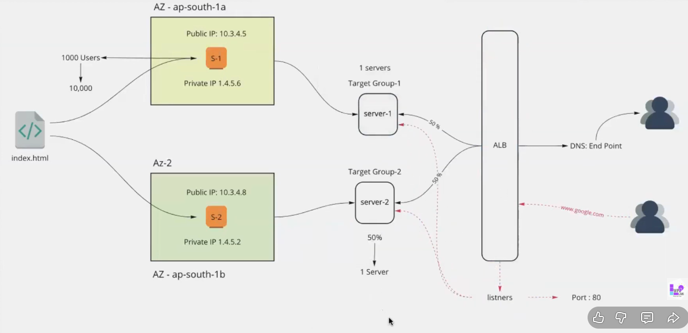

# Application Load Balancer (ALB) Setup — Step-by-Step

Goal: Create an internet-facing Application Load Balancer distributing HTTP traffic across two EC2 instances in different Availability Zones for high availability and failover.



## Prerequisites

- AWS account with Management Console access
- EC2 key pair for SSH access
- Basic knowledge of EC2, VPCs, and networking
- Region example: ap-south-1 (Mumbai)

Important notes:

- All steps use the AWS Management Console.
- Use two EC2 instances in different AZs (e.g., ap-south-1a and ap-south-1b).
- ALB charges apply; terminate resources after testing.

---

## Step 1: Launch EC2 Instances

1. Sign in to the AWS Management Console and open the **EC2 Dashboard**.
2. Click **Launch instance**.

Settings for the first instance:

- Name: `server-1`
- AMI: Red Hat Enterprise Linux (or Amazon Linux 2 for free tier)
- Instance type: `t2.micro`
- Key pair: select your existing key pair
- Network settings:
  - VPC: Default VPC (or a custom VPC)
  - Subnet: choose a subnet in `ap-south-1a`
  - Auto-assign Public IP: **Enable**
- Security group: create `web-sg` allowing:
  - SSH (port 22) from your IP (or 0.0.0.0/0 for quick testing)
  - HTTP (port 80) from 0.0.0.0/0

3. Click **Launch instance**.

Repeat for the second instance:

- Name: `server-2`
- Subnet: select a subnet in `ap-south-1b` (different AZ)
- Use the same AMI, instance type, key pair, and `web-sg` security group.

Tip: Different AZs provide redundancy if an AZ becomes unhealthy.

## Step 2: Configure Web Servers on EC2 Instances

1. SSH into `server-1` using its public IP:

   - Amazon Linux example: `ssh -i your-key.pem ec2-user@<public-ip>`
   - Red Hat example: `ssh -i your-key.pem root@<public-ip>`

2. Install and start Apache (for Red Hat / Amazon Linux):

```bash
sudo yum install httpd -y
sudo systemctl start httpd
sudo systemctl enable httpd
```

3. Create a custom index page on `server-1`:

```bash
echo "Response from server-1" | sudo tee /var/www/html/index.html
```

4. Repeat the SSH and setup steps on `server-2`, using:

```bash
echo "Response from server-2" | sudo tee /var/www/html/index.html
```

5. Verify each server by opening their public IPs in a browser — each should show its respective response.

## Step 3: Create Target Groups

1. In the EC2 console, under **Load Balancing** → **Target Groups**, click **Create target group**.
2. Configure the first target group:

   - Target type: `Instances`
   - Name: `tg-server-1`
   - Protocol: `HTTP`
   - Port: `80`
   - VPC: Default VPC (or the VPC where your instances run)
   - Health check path: `/`

3. Click **Next**, register `server-1` as the target, then **Create target group**.

4. Repeat to create `tg-server-2` and register `server-2`.

Tip: Health checks ensure the ALB routes only to healthy instances. Allow a few minutes for status to become `healthy`.

## Step 4: Create the Application Load Balancer (ALB)

1. In the EC2 console go to **Load Balancers** → **Create load balancer**.
2. Choose **Application Load Balancer** and click **Create**.

3. Configure the ALB:

   - Name: `my-alb`
   - Scheme: `Internet-facing`
   - IP address type: `ipv4`
   - Listeners: `HTTP` on port `80`
   - Availability Zones: select at least the AZs used by your instances (e.g., `ap-south-1a`, `ap-south-1b`)
   - Security groups: choose `web-sg` (must allow port 80)

4. Under **Configure routing**, create listener rules to forward traffic. To distribute across both instances:

   - Create a target group or rule that forwards to both `tg-server-1` and `tg-server-2`.
   - If you need weighted distribution, use advanced routing (forward to multiple target groups with weights) — otherwise ALB balances across registered targets evenly.

5. Click **Create load balancer**.

Note: ALB forwards requests to targets that are registered and healthy in their target groups.

## Step 5: Test the Load Balancer

1. From the Load Balancers list, copy the ALB DNS name (e.g., `my-alb-xxxxxxxx.ap-south-1.elb.amazonaws.com`).
2. Open the DNS name in a browser multiple times — responses should alternate between `Response from server-1` and `Response from server-2`.

3. Simulate failover: stop `server-1` from the EC2 console and refresh the ALB URL — traffic should continue to `server-2` only.

Quick test using curl:

```bash
curl http://<alb-dns-name>
```

Repeat to observe distribution.

## Advanced Setup: DNS with Route 53

1. In Route 53 create a hosted zone for your domain.
2. Create an A (Alias) record pointing to your ALB — choose the ALB from the alias target list.

This lets you use a custom domain (e.g., `example.com`) instead of the ALB DNS name.

## Cleanup

To avoid ongoing charges, remove resources created for testing:

1. Delete the Load Balancer (EC2 → Load Balancers).
2. Deregister and delete target groups (EC2 → Target Groups).
3. Terminate EC2 instances (EC2 → Instances).
4. Delete security groups if not needed.

## References

- AWS: Application Load Balancers — https://docs.aws.amazon.com/elasticloadbalancing/latest/application/introduction.html

---

Happy load balancing! 🚀
