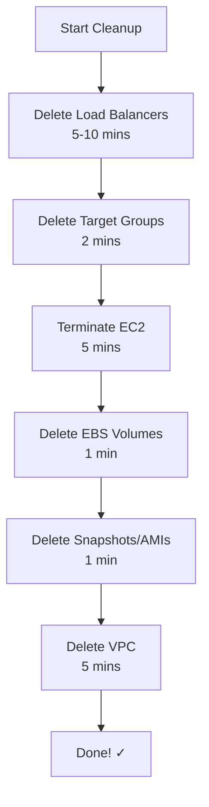
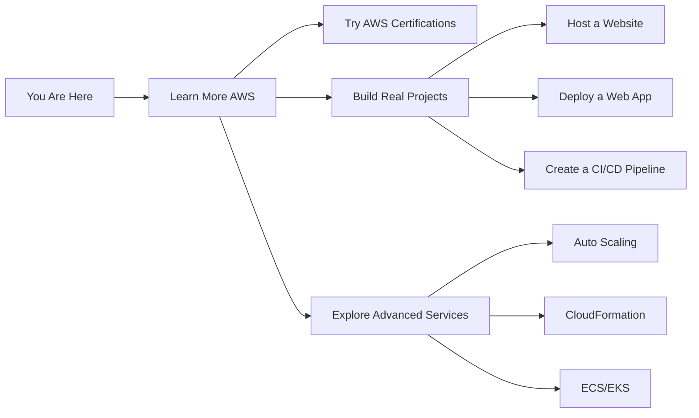

# AWS_ VPC, EC2, EBS, AMI, Snapshots, ALB & NLB 

[](https://aws.amazon.com)


---

## 📚 **What Will You Learn?**

| Topic | What It Does | Real-World Example |
|-------|--------------|-------------------|
| **VPC** | Your private cloud network | Like having your own gated community in the cloud |
| **EC2** | Virtual servers in cloud | Renting computers to run your apps |
| **EBS** | Hard drives for your servers | External USB drives for your computer |
| **AMI** | Server templates | Like a snapshot of your perfectly configured PC |
| **Snapshots** | Backups of your data | Insurance for your important files |
| **ALB** | Smart traffic distributor | Like a traffic police for web traffic |
| **NLB** | Super-fast traffic distributor | Like an express highway for network traffic |

---
## 🎯 **Architecture Overview**

```
                        🌍 INTERNET
                           │
                    ┌──────┴──────┐
                    │   Users     │
                    └──────┬──────┘
                           │
                ┌──────────┴──────────┐
                │   Load Balancers    │
                │  (ALB or NLB)       │
                └──────────┬──────────┘
                           │
         ┌─────────────────┼─────────────────┐
         │                 │                 │
    ┌────┴────┐       ┌────┴────┐       ┌────┴────┐
    │ Web     │       │ Web     │       │ Web     │
    │ Server 1│       │ Server 2│       │ Server 3│
    └────┬────┘       └────┬────┘       └────┬────┘
         │                 │                 │
    ┌────┴────┐       ┌────┴────┐       ┌────┴────┐
    │ EBS     │       │ EBS     │       │ EBS     │
    │ Volume  │       │ Volume  │       │ Volume  │
    └─────────┘       └─────────┘       └─────────┘
         │                 │
    ┌────┴────┐       ┌────┴────┐
    │Snapshot │       │Snapshot │
    └─────────┘       └─────────┘
         │
    ┌────┴────┐
    │   AMI   │
    └─────────┘
```

---

## 🎯 **Quick Start Guide**


## 📋 **Prerequisites - What You Need**

### ✅ **Before You Begin:**
- [ ] AWS Account (Free Tier works!)
- [ ] Basic computer knowledge
- [ ] Patience to learn (we all start somewhere!)
- [ ] Credit card for AWS verification (don't worry, free tier is... free!)

### 🔧 **Tools You'll Need:**
```bash
# For CLI section (optional)
- AWS CLI installed
- Your favorite terminal
- Coffee ☕ (optional but recommended)
```

---

# 🎮 **PART 1: GUI MODE - Click and Learn!**
## *Perfect for beginners - No commands needed!*

---

## 🌐 **Chapter 1: VPC - Your Private Cloud Kingdom**

### 🤔 **What is VPC?**
Imagine you're building a house in a huge city (the internet). VPC is like buying your own piece of land and building a fence around it. Inside this fence, you control everything!

### 🏗️ **Step-by-Step: Building Your VPC**

#### **Step 1: Login to AWS**
```
1. Go to https://aws.amazon.com
2. Click "Sign In to Console"
3. Enter your email and password
4. Choose "Mumbai (ap-south-1)" as your region
```

#### **Step 2: Find VPC Service**
```
🔍 Search for "VPC" in the search bar
📌 Click on "VPC" (it looks like a little cloud icon)
```

#### **Step 3: Create Your VPC**


**Let's do it:**
1. Click 🔵 **Create VPC**
2. Choose: **VPC only**
3. **Name tag**: `my-devops-vpc` (give it a friendly name)
4. **IPv4 CIDR**: `10.17.0.0/24` (your address space)
5. Click **Create VPC**

> 💡 **Simple Explanation:** The `/24` means you can have 256 IP addresses in your network. That's enough for a small company!

---

### 🏘️ **Step 4: Create Subnets - Dividing Your Land**

Think of subnets like different neighborhoods in your city:
- **Public Subnets** = Downtown area (everyone can visit)
- **Private Subnets** = Residential area (only residents)

#### **Creating Public Subnets:**

| Subnet Name | Location | Address Range | Purpose |
|-------------|----------|---------------|---------|
| `public-subnet-1` | Mumbai Zone A | `10.17.1.0/26` | Web servers here |
| `public-subnet-2` | Mumbai Zone B | `10.17.0.64/26` | Backup web servers |

**Click-by-click:**
```
1. Go to "Subnets" in left menu
2. Click "Create subnet"
3. Select your VPC: my-devops-vpc
4. Fill in the details from table above
5. Click "Create subnet"
6. Repeat for all 4 subnets (2 public, 2 private)
```

> 🎯 **Why two of each?** If one AWS data center fails, your app keeps running from the other!

---

### 🚪 **Step 5: Create Internet Gateway - Your Front Door**

**What it does:** Like the main gate to your property. Without it, nobody can enter or leave!


**Steps:**
```
1. Click "Internet Gateways" in left menu
2. Click "Create internet gateway"
3. Name: my-devops-igw
4. Click "Create"
5. Select it → Actions → Attach to VPC
6. Choose my-devops-vpc → Attach
```

---

### 🗺️ **Step 6: Route Tables - Your GPS System**

**Simple analogy:** Route tables are like Google Maps telling your data how to reach its destination.

#### **Public Route Table (The Highway):**
```
1. Go to "Route Tables" → Create route table
2. Name: public-rt
3. VPC: my-devops-vpc
4. Click "Create"

5. Add highway to internet:
   - Select public-rt → Routes → Edit routes
   - Add route: Destination: 0.0.0.0/0, Target: my-devops-igw
   - Save

6. Connect to neighborhoods:
   - Go to "Subnet Associations"
   - Edit → Select public-subnet-1 and public-subnet-2
   - Save
```

#### **Private Route Table (Local Roads):**
```
1. Create: private-rt
2. Associate with: private-subnet-1, private-subnet-2
```

---

### 🔄 **Step 7: NAT Gateway - Secure Internet for Private Areas**

**Why?** Private subnets need internet for updates but shouldn't be directly accessible from outside.

```
1. Go to "NAT Gateways" → Create NAT gateway
2. Name: my-devops-nat-gw
3. Subnet: public-subnet-1 (place it in public area)
4. Connectivity type: Public
5. Click "Create NAT gateway"
6. Wait 2-3 minutes (☕ coffee time!)
7. Go to private-rt → Routes → Add route
8. Destination: 0.0.0.0/0, Target: your NAT gateway
```

> 🏠 **Real-world analogy:** NAT gateway is like a security guard who brings you packages from outside without letting strangers in.

---

## 🖥️ **Chapter 2: EC2 - Your First Cloud Computer**

### 🎮 **What We're Building:**
Two web servers that will host your website!


### **Step 1: Launch Your First Server**

```
1. Go to EC2 Dashboard (search "EC2")
2. Click big orange "Launch instance" button
3. Name: web-server-1
4. AMI: Amazon Linux 2 (free tier)
5. Instance type: t2.micro (free tier)
```

### 🔑 **Step 2: Create Your Key Pair (Your House Key)**

```
1. Click "Create new key pair"
2. Key pair name: my-key
3. Type: RSA
4. Format: .pem (for Mac/Linux) or .ppk (for Windows)
5. Click "Create" and SAVE IT SAFELY!
```

> ⚠️ **WARNING:** If you lose this key, you'll be locked out forever!

### 🔒 **Step 3: Network Settings (Your Security Guards)**

```
Network Settings:
├── VPC: my-devops-vpc
├── Subnet: public-subnet-1
├── Auto-assign IP: Enable
└── Security Group (Firewall Rules):
    ├── SSH (port 22) - Only from YOUR IP
    └── HTTP (port 80) - From everyone (0.0.0.0/0)
```

### 💾 **Step 4: Storage (Your Hard Drive)**
```
Storage: 8 GB gp3 (enough for a website)
```

### 🚀 **Step 5: Launch!**
```
Click "Launch Instance"
Wait for "Success" message
Click "View all instances"
```

### 🔄 **Repeat for Second Server:**
```
Name: web-server-2
Subnet: public-subnet-2
Same key pair and security group
```

---

### 🛠️ **Step 6: Make Your Servers Do Something!**

#### **Connect to Server 1:**
```bash
# On Mac/Linux:
ssh -i my-key.pem ec2-user@<your-server-1-ip>

# On Windows (using Putty):
# Convert .pem to .ppk using PuttyGen first
```

#### **Install Website:**
```bash
# Copy and paste these commands one by one:
sudo yum update -y                    # Update system
sudo yum install httpd -y              # Install web server
sudo systemctl start httpd              # Start web server
sudo systemctl enable httpd             # Auto-start on boot

# Create a welcome page:
echo "<h1>🌍 Welcome to Server 1!</h1>" | sudo tee /var/www/html/index.html
```

#### **Repeat for Server 2:**
```bash
# Same commands, but change the message:
echo "<h1>🌟 Welcome to Server 2!</h1>" | sudo tee /var/www/html/index.html
```

> 🎉 **Test it!** Open browser and type: `http://<your-server-ip>`

---

## 💽 **Chapter 3: EBS - Extra Storage Like USB Drives**

### **Why EBS?**
Your server has 8GB built-in storage. What if you need more? EBS is like adding an external hard drive!

### **Step 1: Create a New Hard Drive**

```
1. Go to EC2 → Volumes (left menu)
2. Click "Create Volume"
3. Settings:
   ├── Type: gp3 (General Purpose)
   ├── Size: 10 GB
   └── Zone: ap-south-1a (same as web-server-1)
4. Click "Create Volume"
5. Wait for "Available" status
```

### **Step 2: Attach to Your Server**

```
1. Select the volume
2. Actions → Attach Volume
3. Instance: web-server-1
4. Device: /dev/sdf
5. Click "Attach"
```

### **Step 3: Format and Mount (Make It Usable)**

SSH into web-server-1 and run:
```bash
# See all disks
lsblk
# You should see /dev/xvdf (or /dev/sdf)

# Format it (like formatting a new USB)
sudo mkfs -t ext4 /dev/xvdf

# Create a folder to attach it to
sudo mkdir /mydata

# Mount it (connect it)
sudo mount /dev/xvdf /mydata

# Check if it worked
df -h | grep mydata
```

### **Step 4: Make It Permanent**

```bash
# Get the UUID of your volume
sudo blkid /dev/xvdf

# Edit fstab (auto-mount configuration)
sudo nano /etc/fstab

# Add this line (use your UUID from above):
UUID=your-uuid-here  /mydata  ext4  defaults,nofail  0  2

# Save: Ctrl+X, then Y, then Enter
```

### **Step 5: Test Auto-Mount**
```bash
# Reboot and check
sudo reboot
# Wait, reconnect, then:
df -h | grep mydata
# Should still be there!
```

---

## 💾 **Chapter 4: AMI & Snapshots - Time Machine for Your Servers**

### 📸 **Snapshots - Taking Photos of Your Data**

#### **Create a Snapshot (Backup):**
```
1. Go to EC2 → Volumes
2. Select your volume (the 10GB one)
3. Actions → Create Snapshot
4. Description: "My data backup - before important changes"
5. Add tag: Name=my-backup
6. Click "Create Snapshot"
7. Note the Snapshot ID (starts with "snap-")
```

#### **View Your Snapshots:**
```
1. Go to EC2 → Snapshots
2. You'll see your backup!
3. Status will change from "pending" to "completed"
```

#### **Create New Volume from Snapshot (Restore):**
```
1. Select your snapshot
2. Actions → Create Volume
3. Choose any AZ (ap-south-1b for testing)
4. Click "Create Volume"
```

#### **Copy Snapshot to Another Region (Disaster Recovery):**
```
1. Select snapshot
2. Actions → Copy Snapshot
3. Destination: US East (N. Virginia)
4. Description: "Backup in another region"
5. Click "Copy Snapshot"
```

---

### 🖼️ **AMI - Taking Photos of Your Whole Server**

**What's an AMI?** Like a snapshot but of the ENTIRE server - OS, software, everything!

#### **Create AMI from Your Server:**
```
1. Go to EC2 → Instances
2. Select web-server-1
3. Actions → Image and templates → Create image
4. Image name: my-web-server-ami-v1
5. Description: "Web server with Apache installed"
6. Check "No reboot" (optional)
7. Click "Create image"
8. Note the AMI ID (starts with "ami-")
```

#### **Launch New Server from AMI:**
```
1. Go to EC2 → AMIs
2. Select your AMI (should show "available")
3. Actions → Launch instance from AMI
4. Follow same steps as before
5. Name: web-server-from-ami
6. Choose subnet
7. Launch!
```

#### **Share AMI with Friend:**
```
1. Select your AMI
2. Actions → Edit AMI permissions
3. Add AWS account ID: 123456789012
4. Click "Save"
```

#### **Copy AMI to Another Region:**
```
1. Select AMI
2. Actions → Copy AMI
3. Destination: US East
4. New name: my-web-ami-us-east
5. Click "Copy AMI"
```

#### **Clean Up:**
```
1. Deregister AMI: Actions → Deregister
2. Delete snapshot: Go to Snapshots → Select → Delete
```

---

## ⚖️ **Chapter 5: ALB - Smart Traffic Director**

### **What is Load Balancing?**
Imagine you have two pizza shops (web servers). A load balancer is like a smart receptionist who sends customers to the least busy shop!


### **Step 1: Create Target Group (Your Server Pool)**

```
1. Go to EC2 → Target Groups
2. Click "Create target group"
3. Settings:
   ├── Target type: Instances
   ├── Name: my-alb-tg
   ├── Protocol: HTTP
   ├── Port: 80
   └── VPC: my-devops-vpc
4. Health checks:
   ├── Protocol: HTTP
   ├── Path: /
   └── Advanced: Use defaults
5. Click "Next"
```

### **Step 2: Register Your Servers**

```
1. Select both web-server-1 and web-server-2
2. Click "Include as pending below"
3. Click "Create target group"
```

### **Step 3: Create the Load Balancer**

```
1. Go to Load Balancers → Create Load Balancer
2. Choose "Application Load Balancer"
3. Basic config:
   ├── Name: my-alb
   ├── Scheme: internet-facing
   ├── IP type: ipv4
   └── Listeners: HTTP:80
4. Network mapping:
   ├── VPC: my-devops-vpc
   ├── Mappings: Select both public subnets
5. Security groups:
   ├── Create new: alb-sg
   ├── Rules: Allow HTTP from anywhere
6. Listeners and routing:
   ├── Default action: Forward to my-alb-tg
7. Review and Create
```

### **Step 4: Test Your Load Balancer**

```
1. Go to Load Balancers
2. Find your ALB
3. Copy DNS name (looks like: my-alb-123456.elb.amazonaws.com)
4. Open in browser multiple times
5. Watch the messages alternate!
```

**Quick test with curl:**
```bash
# Replace with your ALB DNS
curl http://my-alb-123456.elb.amazonaws.com
# Run it multiple times - see different servers!
```

### **Step 5: Test Failover (What if one server dies?)**

```
1. Go to EC2 → Instances
2. Select web-server-1
3. Instance state → Stop
4. Wait for "stopped"
5. Refresh your ALB URL
6. Traffic automatically goes to web-server-2 only!
7. Start web-server-1 again when done
```

---

## 🚀 **Chapter 6: NLB - The Speed Demon**

### **What's Different?**
- **ALB** = Smart (Layer 7 - understands websites)
- **NLB** = Fast (Layer 4 - just moves data quickly)

### **Step 1: Create NLB Target Group**

```
1. Go to Target Groups → Create target group
2. Settings:
   ├── Target type: Instances
   ├── Name: my-nlb-tg
   ├── Protocol: TCP
   ├── Port: 80
   └── VPC: my-devops-vpc
3. Health checks: TCP
4. Register same two servers
5. Click "Create target group"
```

### **Step 2: Create Network Load Balancer**

```
1. Go to Load Balancers → Create Load Balancer
2. Choose "Network Load Balancer"
3. Basic config:
   ├── Name: my-nlb
   ├── Scheme: internet-facing
   ├── Listeners: TCP:80
4. Network mapping:
   ├── VPC: my-devops-vpc
   └── Both public subnets
5. Routing: my-nlb-tg
6. Review and Create
```

### **Step 3: Test NLB**

```
1. Copy NLB DNS name
2. Test in browser
3. Notice it's FAST! (but same content)
```

---

## 📊 **Chapter 7: ALB vs NLB - When to Use What?**

### **Quick Decision Tree:**


### **Detailed Comparison:**

| Scenario | ALB | NLB | Why? |
|----------|-----|-----|------|
| **Website with multiple pages** | ✅ Best | ❌ Overkill | ALB can route `/blog` to different servers |
| **Online game server** | ❌ Slow | ✅ Best | NLB has microsecond latency |
| **Mobile app backend** | ✅ Good | ✅ Also good | Both work, ALB if HTTP, NLB if custom protocol |
| **Banking application** | ✅ Good | ⚠️ Maybe | ALB for security features, NLB for speed |
| **Video streaming** | ❌ Not ideal | ✅ Best | NLB handles high throughput better |
| **Need client IP address** | ⚠️ Via header | ✅ Direct | NLB preserves original IP |
| **Fixed IP for whitelisting** | ❌ No | ✅ Yes | NLB can have Elastic IP |

### **Real-World Examples:**

#### **Use ALB when:**
- Building an e-commerce website
- Running a blog platform
- Microservices with different endpoints
- Need SSL/TLS termination
- Want to use WebSockets

#### **Use NLB when:**
- Building a multiplayer game server
- Streaming live video
- IoT device communication
- Need extreme performance
- Must preserve client IP addresses

---

# ⌨️ **PART 2: CLI MODE - For the Command Line Lovers**
## *Same concepts, but with commands!*

---

## 🛠️ **Setup AWS CLI**

### **Installation:**

**For Mac/Linux:**
```bash
# Download AWS CLI
curl "https://awscli.amazonaws.com/awscli-exe-linux-x86_64.zip" -o "awscliv2.zip"
unzip awscliv2.zip
sudo ./aws/install

# Verify installation
aws --version
```

**For Windows:**
- Download installer from AWS website
- Run the MSI file
- Follow wizard

### **Configure AWS CLI:**
```bash
aws configure
# You'll be prompted for:
AWS Access Key ID: [YOUR_ACCESS_KEY]
AWS Secret Access Key: [YOUR_SECRET_KEY]
Default region name: ap-south-1
Default output format: json
```

> 🔑 **How to get access keys:**
> 1. Go to IAM in AWS Console
> 2. Click on your user
> 3. Go to "Security credentials"
> 4. Click "Create access key"

---

## 📝 **CLI Command Reference**

### **1. VPC Commands**

```bash
# Create VPC
aws ec2 create-vpc \
    --cidr-block 10.17.0.0/24 \
    --tag-specifications 'ResourceType=vpc,Tags=[{Key=Name,Value=my-devops-vpc}]'

# Output: Note the VpcId (looks like: vpc-0abc123xyz)

# Create Subnets
aws ec2 create-subnet \
    --vpc-id vpc-xxxxx \
    --cidr-block 10.17.1.0/26 \
    --availability-zone ap-south-1a \
    --tag-specifications 'ResourceType=subnet,Tags=[{Key=Name,Value=public-subnet-1}]'

# Create Internet Gateway
aws ec2 create-internet-gateway \
    --tag-specifications 'ResourceType=internet-gateway,Tags=[{Key=Name,Value=my-devops-igw}]'

# Attach IGW to VPC
aws ec2 attach-internet-gateway \
    --vpc-id vpc-xxxxx \
    --internet-gateway-id igw-xxxxx
```

### **2. EC2 Commands**

```bash
# Create key pair
aws ec2 create-key-pair \
    --key-name my-key \
    --query 'KeyMaterial' \
    --output text > my-key.pem
chmod 400 my-key.pem

# Create security group
aws ec2 create-security-group \
    --group-name web-sg \
    --description "Web server security" \
    --vpc-id vpc-xxxxx

# Add rules
aws ec2 authorize-security-group-ingress \
    --group-id sg-xxxxx \
    --protocol tcp \
    --port 22 \
    --cidr YOUR_IP/32

aws ec2 authorize-security-group-ingress \
    --group-id sg-xxxxx \
    --protocol tcp \
    --port 80 \
    --cidr 0.0.0.0/0

# Launch instance
aws ec2 run-instances \
    --image-id ami-0c55b159cbfafe1f0 \
    --instance-type t2.micro \
    --key-name my-key \
    --security-group-ids sg-xxxxx \
    --subnet-id subnet-public-1 \
    --associate-public-ip-address \
    --tag-specifications 'ResourceType=instance,Tags=[{Key=Name,Value=web-server-1}]'
```

### **3. EBS Commands**

```bash
# Create volume
aws ec2 create-volume \
    --volume-type gp3 \
    --size 10 \
    --availability-zone ap-south-1a \
    --tag-specifications 'ResourceType=volume,Tags=[{Key=Name,Value=my-data-volume}]'

# Attach volume
aws ec2 attach-volume \
    --volume-id vol-xxxxx \
    --instance-id i-xxxxx \
    --device /dev/sdf

# Detach volume
aws ec2 detach-volume --volume-id vol-xxxxx

# Delete volume
aws ec2 delete-volume --volume-id vol-xxxxx
```

### **4. Snapshot & AMI Commands**

```bash
# Create snapshot
aws ec2 create-snapshot \
    --volume-id vol-xxxxx \
    --description "My backup" \
    --tag-specifications 'ResourceType=snapshot,Tags=[{Key=Name,Value=my-backup}]'

# Create AMI from instance
aws ec2 create-image \
    --instance-id i-xxxxx \
    --name "my-web-ami-v1" \
    --description "Web server with Apache" \
    --no-reboot

# Copy snapshot to another region
aws ec2 copy-snapshot \
    --source-region ap-south-1 \
    --source-snapshot-id snap-xxxxx \
    --description "Backup in US" \
    --region us-east-1

# Share AMI
aws ec2 modify-image-attribute \
    --image-id ami-xxxxx \
    --launch-permission "Add=[{UserId=123456789012}]"
```

### **5. ALB Commands**

```bash
# Create target group
aws elbv2 create-target-group \
    --name my-alb-tg \
    --protocol HTTP \
    --port 80 \
    --vpc-id vpc-xxxxx \
    --health-check-path /

# Register targets
aws elbv2 register-targets \
    --target-group-arn arn:aws:elasticloadbalancing:ap-south-1:123456789012:targetgroup/my-alb-tg/xxxxx \
    --targets Id=i-xxxxx Id=i-xxxxx

# Create load balancer
aws elbv2 create-load-balancer \
    --name my-alb \
    --scheme internet-facing \
    --type application \
    --subnets subnet-public-1 subnet-public-2 \
    --security-groups sg-alb-xxxxx

# Create listener
aws elbv2 create-listener \
    --load-balancer-arn arn:aws:elasticloadbalancing:ap-south-1:123456789012:loadbalancer/app/my-alb/xxxxx \
    --protocol HTTP \
    --port 80 \
    --default-actions Type=forward,TargetGroupArn=arn:aws:elasticloadbalancing:ap-south-1:123456789012:targetgroup/my-alb-tg/xxxxx
```

### **6. NLB Commands**

```bash
# Create NLB target group
aws elbv2 create-target-group \
    --name my-nlb-tg \
    --protocol TCP \
    --port 80 \
    --vpc-id vpc-xxxxx

# Register targets
aws elbv2 register-targets \
    --target-group-arn arn:aws:elasticloadbalancing:ap-south-1:123456789012:targetgroup/my-nlb-tg/xxxxx \
    --targets Id=i-xxxxx Id=i-xxxxx

# Create NLB
aws elbv2 create-load-balancer \
    --name my-nlb \
    --scheme internet-facing \
    --type network \
    --subnets subnet-public-1 subnet-public-2

# Create listener
aws elbv2 create-listener \
    --load-balancer-arn arn:aws:elasticloadbalancing:ap-south-1:123456789012:loadbalancer/net/my-nlb/xxxxx \
    --protocol TCP \
    --port 80 \
    --default-actions Type=forward,TargetGroupArn=arn:aws:elasticloadbalancing:ap-south-1:123456789012:targetgroup/my-nlb-tg/xxxxx
```

---

## 🧹 **Chapter 8: Clean Up - Don't Get Billed!**

### **IMPORTANT: Always clean up to avoid charges!**

### **GUI Cleanup Checklist:**



### **Detailed Steps:**

#### **1. Delete Load Balancers**
```
EC2 → Load Balancers → Select ALB/NLB → Actions → Delete
Wait for deletion (takes a few minutes)
```

#### **2. Delete Target Groups**
```
EC2 → Target Groups → Select → Delete
```

#### **3. Terminate EC2 Instances**
```
EC2 → Instances → Select both → Instance state → Terminate
Confirm → Wait for "terminated"
```

#### **4. Delete EBS Volumes**
```
EC2 → Volumes → Select (except root volumes) → Actions → Delete
```

#### **5. Delete Snapshots & Deregister AMIs**
```
EC2 → Snapshots → Select → Actions → Delete
EC2 → AMIs → Select → Actions → Deregister
```

#### **6. Delete VPC**
```
VPC → Your VPCs → Select → Actions → Delete VPC
(This auto-deletes subnets, route tables, etc.)
```

### **CLI Cleanup Commands:**

```bash
# Delete load balancers
aws elbv2 delete-load-balancer --load-balancer-arn <alb-arn>
aws elbv2 delete-load-balancer --load-balancer-arn <nlb-arn>

# Delete target groups
aws elbv2 delete-target-group --target-group-arn <tg-arn>

# Terminate instances
aws ec2 terminate-instances --instance-ids i-xxxxx i-xxxxx

# Delete volumes
aws ec2 delete-volume --volume-id vol-xxxxx

# Delete snapshots
aws ec2 delete-snapshot --snapshot-id snap-xxxxx

# Deregister AMI
aws ec2 deregister-image --image-id ami-xxxxx

# Delete VPC (and all dependencies)
aws ec2 delete-vpc --vpc-id vpc-xxxxx
```

---

## 🎓 **Chapter 9: Key Takeaways & Best Practices**

### **💡 What You've Learned:**

| Service | Key Concept | Remember This |
|---------|-------------|---------------|
| **VPC** | Networking | Always plan your IP ranges first |
| **EC2** | Virtual Servers | Use security groups like a firewall |
| **EBS** | Block Storage | Snapshot before making changes |
| **AMI** | Server Templates | Create AMIs of configured servers |
| **Snapshots** | Backups | Store in different regions for safety |
| **ALB** | Layer 7 Load Balancer | Perfect for web apps |
| **NLB** | Layer 4 Load Balancer | Best for high performance |

### **✅ Pro Tips:**

1. **Always use tags!** They help find resources later
2. **Start small**, then scale up
3. **Use free tier** for learning (t2.micro, 30GB EBS)
4. **Set up billing alerts** to avoid surprises
5. **Clean up** after practicing
6. **Document your architecture** (like this guide!)
7. **Practice in one region** first, then explore others

### **🚨 Common Mistakes to Avoid:**

```
❌ Leaving resources running ($$$)
❌ Using default VPC for production
❌ Opening SSH to整个世界 (0.0.0.0/0)
❌ Not backing up with snapshots
❌ Mixing up public and private subnets
❌ Forgetting to attach IGW to public subnets
```

---

## 📚 **Chapter 10: Resources & Next Steps**

### **Where to Go From Here:**



### **📖 Recommended Learning Path:**

1. **Practice what you learned** (1-2 weeks)
2. **Build a small project** (static website)
3. **Learn Auto Scaling** (add/remove servers automatically)
4. **Explore AWS certifications** (Cloud Practitioner first)
5. **Join AWS community** (forums, meetups)

### **🔗 Helpful Links:**

- [AWS Free Tier](https://aws.amazon.com/free/)
- [AWS Documentation](https://docs.aws.amazon.com/)
- [AWS Training](https://www.aws.training/)
- [AWS Calculator](https://calculator.aws/) (estimate costs)
- [AWS Well-Architected](https://aws.amazon.com/architecture/well-architected/)

### **📺 Video Reference:**

This guide is based on the amazing AWS Telugu Playlist:
- **Video 8-10:** EC2 + VPC Basics
- **Video 11-12:** EBS & Snapshots
- **Video 13-14:** AMI Management
- **Video 15:** ALB Deep Dive
- **Video 16:** NLB Explained

[Watch the playlist here!](https://youtube.com/playlist?list=PLneBjIzDLECkYQ7dYpvWFSgEwTMeZkykF)

---

## 🎉 **Congratulations!**

You've just learned the fundamentals of AWS DevOps! You can now:

✅ Create your own private cloud network (VPC)  
✅ Launch and configure virtual servers (EC2)  
✅ Add and manage storage (EBS)  
✅ Create backups and templates (AMI/Snapshots)  
✅ Distribute traffic smartly (ALB)  
✅ Handle high-performance traffic (NLB)  

### **Your AWS Journey Has Just Begun!**

Remember: 
- **Practice makes perfect** - try everything twice
- **Start simple** - master basics before advanced
- **Stay curious** - AWS adds new services constantly
- **Help others** - teaching reinforces learning

---

## 📝 **Quick Reference Card**

### **Common AWS Limits (Free Tier):**
```
EC2 instances: 750 hours/month (t2.micro)
EBS storage: 30 GB/month
Load Balancer: 750 hours/month